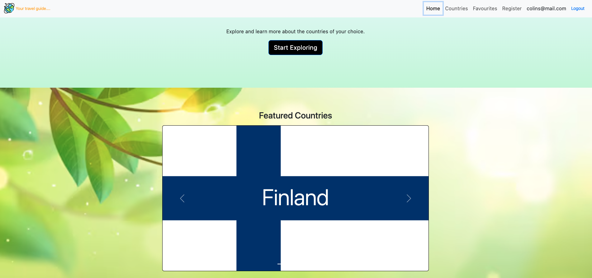

# Countries App

The Countries App is a React-based web application that allows users to explore details about various countries, save their favourite ones, and manage user authentication. The app integrates with Firebase for authentication, React Bootstrap and Bootstrap for UI components. It also uses Redux for state management and React Router for navigation.

# Features
1. Browse Countries: View detailed information about different countries.
2. Favourites: Save favourite countries and manage them in a dedicated favourites section.
3. Authentication: Log in, register, and log out functionality using Firebase authentication.
4. Responsive UI: Built using React Bootstrap for a seamless and responsive design.
4. Protected Routes: Certain routes are accessible only to authenticated users.

# Technologies Used
1. Authentication: Firebase Authentication
2. Frontend: React, React Router, Redux, React Bootstrap
3. Routing: React Router
4. State Management: Redux
5. UI Components: React Bootstrap, Bootstrap

# Prerequisites
1. Firebase Account: You need a Firebase account and a project set up to use Firebase Authentication.
2. Node.js: Make sure you have Node.js installed on your machine. You can download it from Node.js official website.

# Installation
1. Clone repository:
    1. https://github.com/ekundayoSO/countries-bootstrap-react24k-lessons.git
    2. `cd countries-bootstrap-react24k-lessons`
2. Run the following command to install the required dependencies:
    ```bash
    npm install
    ```
3. Create a Firebase project and set up Firebase Authentication.
4. Set up `.env`:
    - `VITE_FIREBASE_API_KEY`
    - `VITE_WEATHER_API_KEY`
    - `VITE_MAPBOX_API_KEY`
5. Start the development server:
    ```bash
    npm run dev
    ```

# Hosting
- `https://ekundayoso-countries-app.netlify.app`
